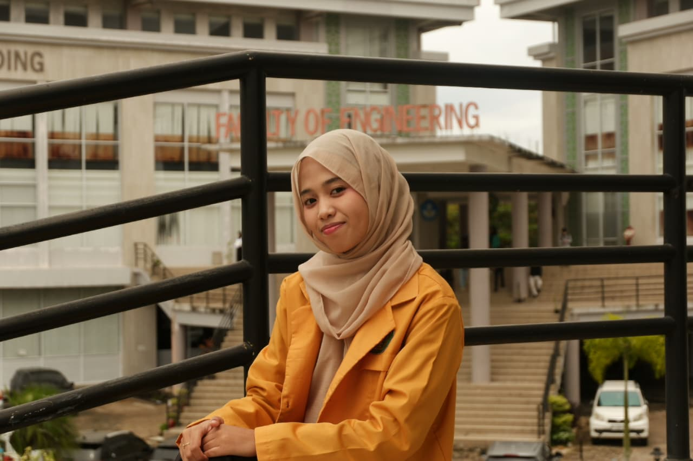
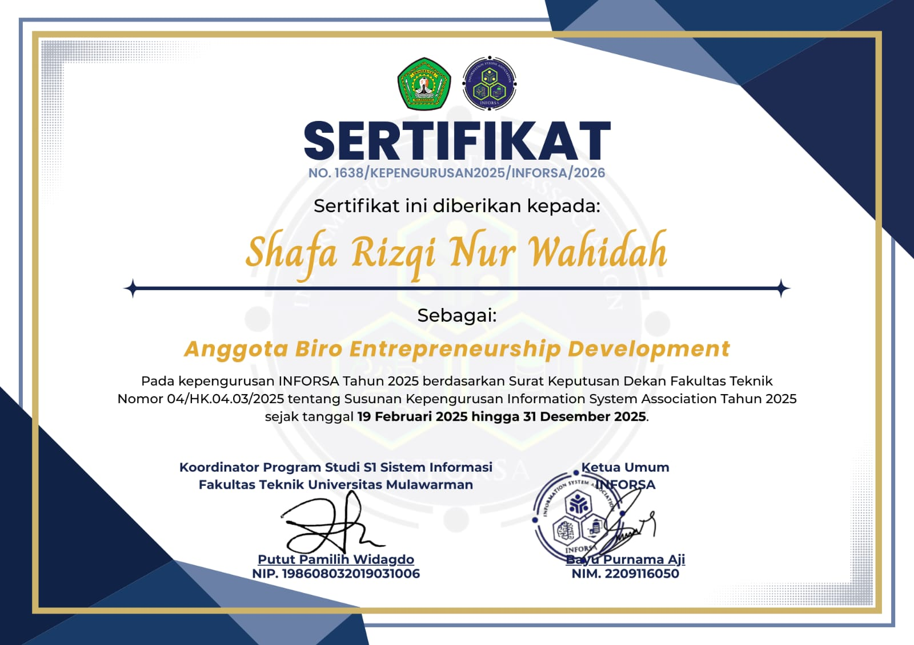
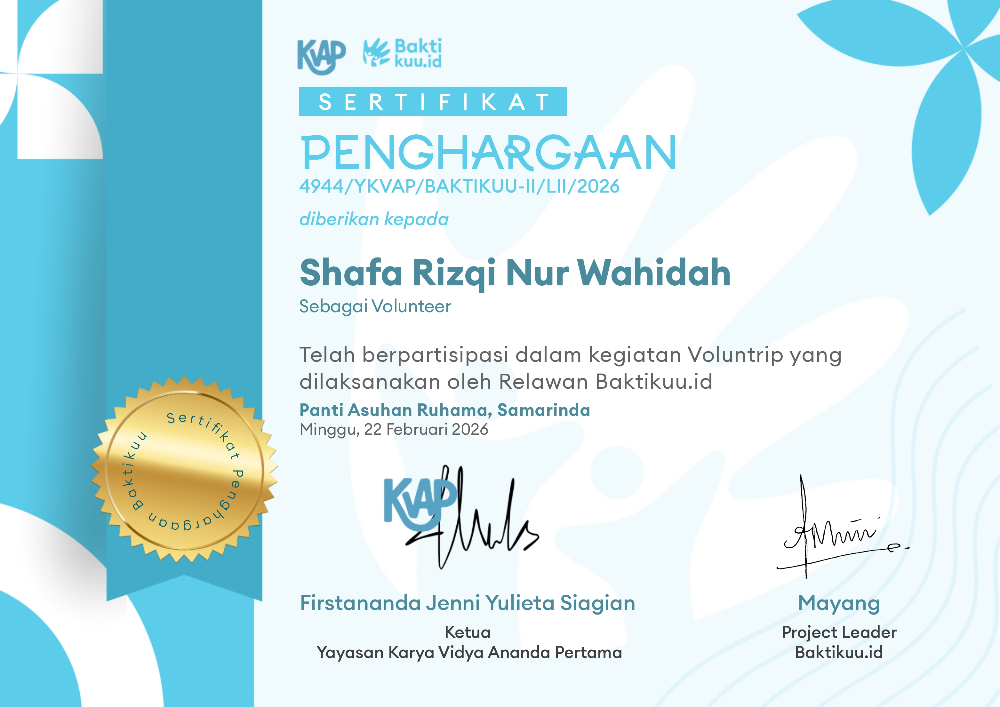
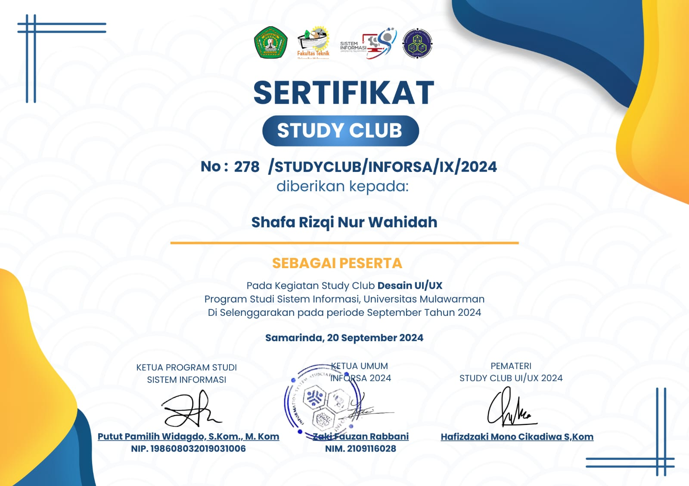

# Shafa's Portofolio

Shafa Rizqi Nur Wahidah (2409116041)

Sistem Informasi B 2024

# Deskripsi Project

Project ini merupakan website portofolio statis yang dibuat untuk memenuhi tugas Praktikum Pemrograman Berbasis Website (PBW).

Website ini dirancang dengan konsep clean design dan soft color palette agar terlihat profesional namun tetap nyaman dilihat. Layout dibuat responsif menggunakan Bootstrap 5 sehingga dapat menyesuaikan berbagai ukuran layar (desktop, tablet, dan mobile).

Website ini memiliki beberapa section utama yaitu:

1. Navbar

2. Home (Hero Section)

3. About Me

4. Skills (Progress Bar)

5. Experiences

6. Certificates

# Tampilan Setiap Section / Fitur

**1. Navbar**

Menampilkan:

- Nama brand website

- Navigasi ke Home

- Navigasi ke About Me

- Navigasi ke Certificates

- Responsive hamburger menu saat layar kecil

Menggunakan:

- Bootstrap Navbar Component

- Bootstrap Collapse

- Utility class Bootstrap

- Custom CSS

Kode:

```dart
<nav class="navbar navbar-expand-lg fixed-top custom-navbar">
        <div class="container">
            <a class="navbar-brand" href="#">Shafa's Portofolio</a>

            <button class="navbar-toggler" type="button" data-bs-toggle="collapse" data-bs-target="#navbarNav">
                <span class="navbar-toggler-icon"></span>
            </button>

            <div class="collapse navbar-collapse" id="navbarNav">
                <ul class="navbar-nav ms-auto">
                    <li class="nav-item">
                        <a class="nav-link" href="#home">Home</a>
                    </li>
                    <li class="nav-item">
                        <a class="nav-link" href="#about">About Me</a>
                    </li>
                    <li class="nav-item">
                        <a class="nav-link" href="#certificates">Certificates</a>
                    </li>
                </ul>
            </div>
        </div>
    </nav>
```

Penjelasan Kode:

Navbar menggunakan komponen bawaan Bootstrap dengan class navbar sebagai container utama navigasi.

Class navbar-expand-lg berarti navbar akan dalam keadaan collapse (hamburger menu) pada layar kecil dan akan expand (horizontal menu) pada ukuran layar large (≥992px).

Class fixed-top membuat navbar selalu berada di bagian atas halaman meskipun halaman di-scroll.

Class custom-navbar adalah class tambahan dari file CSS yang digunakan untuk mengatur warna background navbar agar sesuai dengan tema website.

Bagian tombol:

```dart
<button class="navbar-toggler" type="button" data-bs-toggle="collapse" data-bs-target="#navbarNav">
```

navbar-toggler digunakan untuk membuat tombol hamburger.

data-bs-toggle="collapse" mengaktifkan fitur collapse Bootstrap.

data-bs-target="#navbarNav" menghubungkan tombol dengan div yang memiliki id navbarNav.

Bagian menu:

 ```dart
<div class="collapse navbar-collapse" id="navbarNav">
```

collapse navbar-collapse memungkinkan menu tersembunyi saat layar kecil.

ms-auto pada

```dart
<ul> 
```

digunakan untuk membuat menu rata kanan (margin start auto).

Navigasi menggunakan anchor link (href="#home") yang mengarah ke id section tertentu, sehingga memungkinkan smooth scroll antar bagian halaman.

**2. Home (Hero Section)**

Menampilkan:

- Foto profil

- Nama lengkap

- Status mahasiswa

- Tombol navigasi ke About

Menggunakan:

- Bootstrap Card

- Bootstrap Shadow

- Flexbox Utilities

- Custom CSS

Kode:

```dart
<section id="home" class="hero d-flex align-items-center text-center">
    <div class="container text-center">

        <div class="card hero-card shadow mx-auto">
            
            <div class="card-body">
                <h2 class="fw-bold">Shafa Rizqi Nur Wahidah</h2>
                <p class="lead mb-0">Information Systems Undergraduate</p>
            </div>
        </div>

        <a href="#about" class="btn btn-primary mt-4">See More</a>

    </div>
</section>
```

Penjelasan Kode:

Section ini memiliki id="home" agar dapat diakses dari navbar.

Class hero pada CSS mengatur:

min-height: 100vh; → membuat section setinggi 1 layar penuh.

padding-top: 120px; → memberi jarak dari navbar fixed-top.

Background color khusus untuk membedakan section.

Class d-flex align-items-center digunakan untuk membuat konten berada di tengah secara vertikal menggunakan Flexbox.

text-center membuat seluruh konten di dalam section rata tengah.

Bagian card:

card adalah komponen Bootstrap.

shadow memberi efek bayangan.

mx-auto membuat card berada di tengah secara horizontal.

Class hero-img di CSS mengatur:

Lebar 100%

Tinggi tetap 350px

object-fit: cover agar gambar tidak terdistorsi

object-position: center agar fokus gambar tetap di tengah

Tombol:

btn btn-primary menggunakan styling Bootstrap.

Styling warna diubah melalui CSS .btn-primary.

**3 About Me + Skills + Experiences**

Menampilkan:

- Deskripsi diri dalam bentuk paragraf

- Skill dengan progress bar

- Pengalaman dalam bentuk list

Menggunakan:

- Bootstrap Grid System

- Bootstrap Progress Component

- Typography utilities

Kode:

```dart
<section id="about" class="py-5">
    <div class="container">
        <div class="row">

            <!-- About Me -->
            <div class="col-md-6">
                <h2 class="mb-4 fw-bold">About Me</h2>
                <p>
                    Hi! I am an Information Systems undergraduate at Mulawarman University with a strong interest in Data Analysis and UI/UX Design. I am passionate about transforming data into meaningful insights and creating user-centered designs that deliver impactful digital experiences.
                </p>

                <p>
                    Through academic projects and volunteer experiences, I have developed strong analytical thinking, problem-solving, and teamwork skills. I enjoy collaborating with others, learning new technologies, and continuously improving my abilities to adapt to dynamic environments.
                </p>

                <p>
                    I am detail-oriented, responsible, and highly motivated to grow both personally and professionally. For me, technology is not just about systems, it is about building solutions that create real value for people.
                </p>
            </div>

            <!-- Skills & Experiences -->
            <div class="col-md-6">

                <h2 class="fw-bold">Skills</h2>

                <div class="mb-3">
                    <label>Canva</label>
                    <div class="progress">
                        <div class="progress-bar bg-success" style="width: 90%">90%</div>
                    </div>
                </div>

                <div class="mb-3">
                    <label>Excel</label>
                    <div class="progress">
                        <div class="progress-bar bg-info" style="width: 85%">85%</div>
                    </div>
                </div>

                <div class="mb-3">
                    <label>Figma</label>
                    <div class="progress">
                        <div class="progress-bar bg-warning" style="width: 75%">75%</div>
                    </div>
                </div>

                <h2 class="fw-bold mt-4">Experiences</h2>
                <ul>
                    <li>Staff of Bureau Entrepreneurship Development INFORSA 2025/2026</li>
                    <li>Volunteer of Baktikuu.id</li>
                    <li>UI/UX Design Study Club Participant</li>
                </ul>

            </div>

        </div>
    </div>
</section>
```dart

Penjelasan Kode:

Section menggunakan py-5 untuk memberikan padding vertikal besar.

Layout menggunakan Bootstrap Grid:

row sebagai pembungkus kolom

col-md-6 berarti pada layar medium ke atas akan terbagi dua kolom, sedangkan pada layar kecil akan menjadi satu kolom (stacked).

Bagian Skills:

Komponen progress Bootstrap terdiri dari:

```dart
<div class="progress">
    <div class="progress-bar" style="width: 90%">90%</div>
</div>
```

progress sebagai container.

progress-bar sebagai bar yang bergerak.

style="width: 90%" menentukan panjang bar sesuai persentase skill.

Warna diatur menggunakan class seperti bg-success, bg-info, bg-warning.

Bagian Experiences menggunakan <ul> untuk menampilkan daftar pengalaman secara terstruktur dan sederhana.

CSS tambahan pada #about mengatur:

Warna teks menjadi hitam

Spacing antar elemen

Line-height untuk kenyamanan membaca

**4. Certificates**

Menampilkan:

- Gambar sertifikat

- Judul sertifikat

- Nama instansi

Menggunakan:

- Bootstrap Grid

- Bootstrap Card

- Utility classes

Kode:

```dart
<section id="certificates" class="py-5 bg-light">
        <div class="container">
            <h2 class="text-center mb-4 fw-bold">Certificates</h2>

            <div class="row justify-content-center">

                <div class="col-md-5 col-lg-4 mb-4">
                    <div class="card shadow">
                        
                        <div class="card-body">
                            <h5 class="card-title">Staff of EDEN</h5>
                            <p class="card-text">Information Systems Association</p>
                        </div>
                    </div>
                </div>

                <div class="col-md-5 col-lg-4 mb-4">
                    <div class="card shadow">
                        
                        <div class="card-body">
                            <h5 class="card-title">Volunteer</h5>
                            <p class="card-text">Baktikuu.id</p>
                        </div>
                    </div>
                </div>

                <div class="col-md-5 col-lg-4 mb-4">
                    <div class="card shadow">
                        
                        <div class="card-body">
                            <h5 class="card-title">UI/UX Design</h5>
                            <p class="card-text">Information Systems</p>
                        </div>
                    </div>
                </div>

            </div>
        </div>
    </section>
```

Penjelasan Kode:

Section ini menggunakan bg-light untuk memberikan kontras dengan section sebelumnya.

row justify-content-center digunakan untuk meratakan card ke tengah.

col-md-5 col-lg-4 membuat layout responsif:

2 kolom pada medium

3 kolom pada large

Setiap sertifikat dibungkus dalam komponen card dengan shadow untuk efek elevasi.

# Teknologi yang Digunakan

**1. HTML5**

Digunakan untuk membuat struktur dan kerangka website seperti section, navbar, card, dan list.

**2. CSS3**

Digunakan untuk mengatur warna, typography, layout tambahan, serta custom styling agar sesuai dengan konsep desain.

**3. Bootstrap 5 (Nilai Tambah**

Digunakan untuk:

- Grid System

- Navbar

- Card

- Progress Bar

- Utility Classes

- Responsive Design

# Struktur Project

```dart
minpro1_pbw/
├── index.html
├── style.css
└── images/
    ├── profile.jpg
    ├── certificate1.jpg
    ├── certificate2.jpg
    └── certificate3.jpg
```
